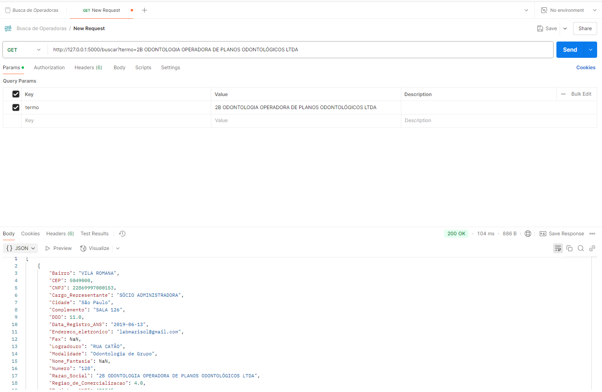
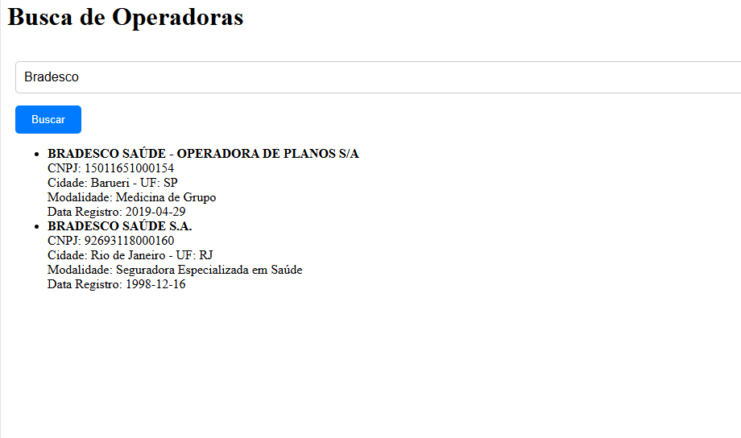

📝 API de Busca de Operadoras de Saúde

Este projeto consiste em uma API backend construída com Flask, que permite buscar informações sobre operadoras de saúde a partir de um arquivo CSV, e um frontend simples em Vue.js para interagir com a API. O sistema permite ao usuário buscar operadoras por diferentes termos, como nome, CNPJ, cidade e modalidade.

Funcionalidades
Backend (API): Exposição de dados em formato JSON para permitir buscas por operadoras de saúde.

Frontend (Vue.js): Interface de busca onde o usuário pode digitar um termo e visualizar os resultados retornados pela API.

Tecnologias Utilizadas
Backend: Flask (Python)

Frontend: Vue.js

Banco de Dados: Arquivo CSV (relatório de operadoras)

Como Executar o Projeto
Passo 1: Configuração do Backend
Instalar dependências:

Certifique-se de ter o Python 3 e o pip instalados.

Crie um ambiente virtual (opcional, mas recomendado):

bash
Copiar
Editar
python -m venv venv
source venv/bin/activate  # No Windows use `venv\Scripts\activate`
Instalar pacotes necessários:

bash
Copiar
Editar
pip install flask pandas flask-cors
Executar o servidor Flask:

Certifique-se de que o arquivo Relatorio_cadop.csv esteja na pasta data/.

Execute o script do servidor Flask:

bash
Copiar
Editar
python app.py
O servidor Flask irá rodar em http://127.0.0.1:5000/ por padrão.

Passo 2: Configuração do Frontend (Vue.js)
Instalar dependências do Vue:

Certifique-se de ter o Node.js e o npm instalados.

No diretório do frontend, execute:

bash
Copiar
Editar
npm install
Executar o servidor Vue:

Inicie o servidor de desenvolvimento:

bash
Copiar
Editar
npm run serve
O frontend Vue estará disponível em http://localhost:8080/.

Passo 3: Testando a Aplicação

No frontend, digite um termo de busca (exemplo: nome de uma operadora de saúde) e pressione Enter ou clique em "Buscar".

O frontend fará uma requisição à API backend, que irá buscar as operadoras que correspondem ao termo informado no arquivo CSV.

Os resultados serão exibidos na tela.

Exemplos de Teste com o Postman
Requisição de Busca (GET)
URL: http://127.0.0.1:5000/buscar?termo=operadora

Método: GET

Exemplo de resposta:

Como Funciona a Busca
O script Python usa o pandas para carregar o arquivo CSV e procurar registros que correspondam ao termo de pesquisa fornecido. O frontend envia essa solicitação para o servidor, e os resultados são retornados como um JSON, que o Vue.js então exibe.

Estrutura do Projeto
TESTE-API/
├── app.py              # Script do backend Flask
├── data/               # Diretório onde o CSV de operadoras é armazenado
│   └── Relatorio_cadop.csv
├── frontend/           # Código do frontend Vue.js
│   ├── src/            # Componentes Vue.js
│   └── public/         # Arquivos estáticos
├── images/             # Imagens usadas no README
│   ├── postman_json.png
│   └── vue.png
└── README.md           # Este arquivo
Funcionamento no Frontend
A seguir está uma captura de tela que demonstra o funcionamento da interface do usuário em Vue.js.

